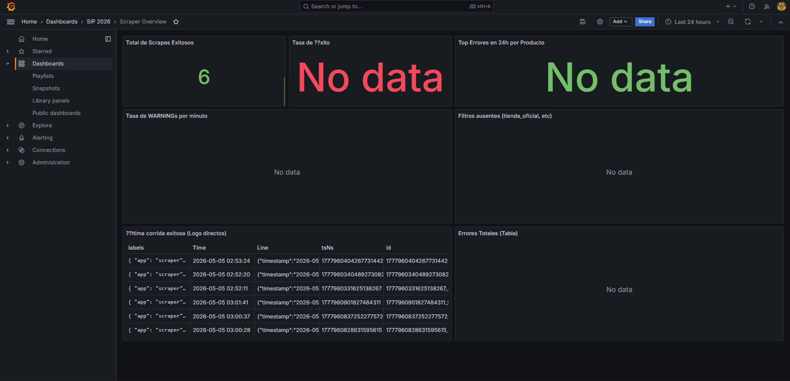

# HIT #5 — Dashboard Grafana provisionado as-code

## Objetivo

Construir un dashboard único en Grafana que unifique las métricas más críticas del scraper y provisionarlo estrictamente *as-code* vía ConfigMap para que aparezca automáticamente en cualquier entorno.

## Qué se hizo

### 1. Construcción del Dashboard JSON
Se diseñó y generó el archivo `observability/dashboards/scraper-overview.json` de manera completamente declarativa, inyectando las queries LogQL requeridas en los 7 paneles solicitados:

- **Fila Superior (Stat panels):**
  - *Total de scrapes (exitosos):* `sum(count_over_time({namespace="ml-scraper", app="scraper"} | json | message="Scrape completado" [$__range]))`
  - *Tasa de éxito (%):* Proporción calculada matemáticamente de "Scrape completado" vs "Scrape iniciado".
  - *Top Errores:* Volumen de alertas de nivel ERROR en el rango de tiempo seleccionado.
- **Fila Media (Time series):**
  - *Tasa de WARNINGs (Q2):* Detecta ráfagas de bloqueos o reintentos en el tiempo.
  - *Filtros Ausentes (Q3):* Cuantifica las omisiones dinámicas de MercadoLibre (ej. `tienda_oficial`).
- **Fila Inferior (Tablas):**
  - *Última corrida exitosa (Q5):* Muestra los últimos logs crudos ordenados por producto utilizando `topk(1)`.
  - *Errores Totales:* Tabulación detallada.

### 2. Actualización del LogQL Cookbook
Adicionalmente a la creación del dashboard, se actualizó el documento `observability/queries/logql-cookbook.md` para incluir la métrica obligatoria que faltaba documentar (**Q3 — Conteo de filtros no disponibles**), completando las 5 queries operativas exigidas.

### 3. Provisioning en Kubernetes
El JSON se inyectó en el cluster usando la herramienta estándar de Kubernetes. Este proceso ya viene automatizado en nuestro `install.ps1`, pero la ejecución equivalente manual fue:
```bash
kubectl -n observability create configmap scraper-overview-dashboard \
  --from-file="scraper-overview.json=observability/dashboards/scraper-overview.json" \
  --dry-run=client -o yaml | kubectl apply -f -
```

Grafana detecta este ConfigMap gracias al volumen montado en `extraConfigmapMounts` de su chart de Helm y el provider declarado para la carpeta "SIP 2026".

## Validación

1. En Grafana → Dashboards → carpeta **SIP 2026** aparece automáticamente **Scraper Overview**.
2. Al ejecutar un *CronJob* manual en k3s (`kubectl -n ml-scraper create job --from=cronjob/scraper-hourly scraper-test`), los *stat panels* y *time series* se pueblan con la data recolectada de los logs JSON estructurados creados en el Hit 3.

### Troubleshooting (Resolución de problemas)
Durante el despliegue se identificaron y solucionaron dos problemas críticos que causaban que los paneles mostraran "No Data":
1. **Binding del Datasource Loki:** La exportación por defecto de Grafana incluía un `uid` estricto para Loki que no coincidía con el aprovisionado por Helm. Se editó el JSON para establecer `uid: null` (o `uid: "${DS_LOKI}"`), permitiendo que Grafana use el datasource de Loki aprovisionado automáticamente.
2. **Corrección de LogQL:** Se ajustaron las queries del dashboard para coincidir exactamente con los logs estructurados emitidos por la aplicación Java (ej: `message="Scrape completado"`).

## Captura de validación


