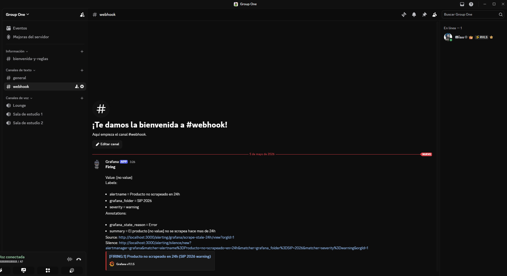

# HIT #6 — Alertas (opcional, bonus +5%)

## Objetivo

Configurar una alerta Grafana Alerting que notifique a un webhook de Discord cuando se cumplan condiciones de fallo del scraper.

## Condiciones de alerta

1. **CronJob falla 2 veces seguidas**: basado en logs `level=ERROR` con `event=scrape_failed`
2. **Producto no scrapeado en 24h**: basado en la query Q5 — última corrida exitosa > 24h vieja

## Qué se hizo

### 1. Contact point Discord

Configurado en Grafana → Alerting → Contact points → Discord webhook URL.

**Security**: El URL del webhook se maneja via variable de entorno `DISCORD_WEBHOOK_URL` y k8s Secret. NO commiteado en el repo.

### 2. Alert rule provisioning

Archivo: `observability/manifests/alert-rules.yaml`

Ejemplo de regla para condición #2:

```yaml
apiVersion: 1
groups:
  - orgId: 1
    name: scraper-health
    folder: SIP 2026
    interval: 5m
    rules:
      - uid: scrape-stale-24h
        title: "Producto no scrapeado en 24h"
        condition: A
        data:
          - refId: A
            datasourceUid: <UID-de-Loki>
            model:
              expr: |
                (time() - max(last_over_time(
                  {namespace="ml-scraper", app="scraper"}
                    | json | message="Scrape completado"
                    | unwrap timestamp [25h]
                )) by (producto)) > 86400
        noDataState: Alerting
        execErrState: Alerting
        for: 10m
        annotations:
          summary: "El producto {{ $labels.producto }} no se scrapea hace más de 24h"
        labels:
          severity: warning
```

### 3. Variables de entorno

| Variable | Requerida | Descripción |
|---|---|---|
| `DISCORD_WEBHOOK_URL` | No (bonus) | Webhook de Discord para notificaciones |

### 4. Validación

Simular fallo escalando el CronJob a `suspend: true` o modificando temporalmente el threshold a `> 600` (10 min) para ver la alerta disparar.

## Captura de validación


