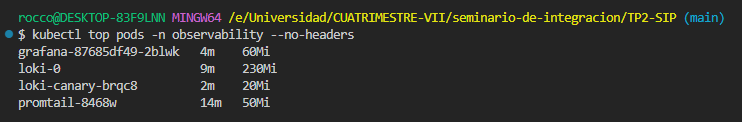
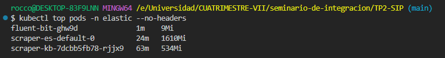
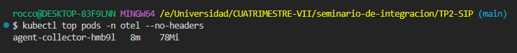
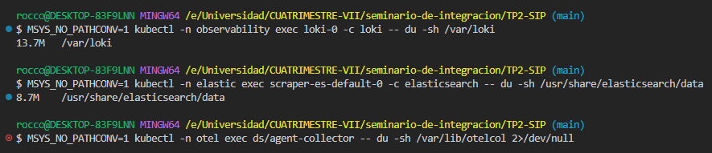
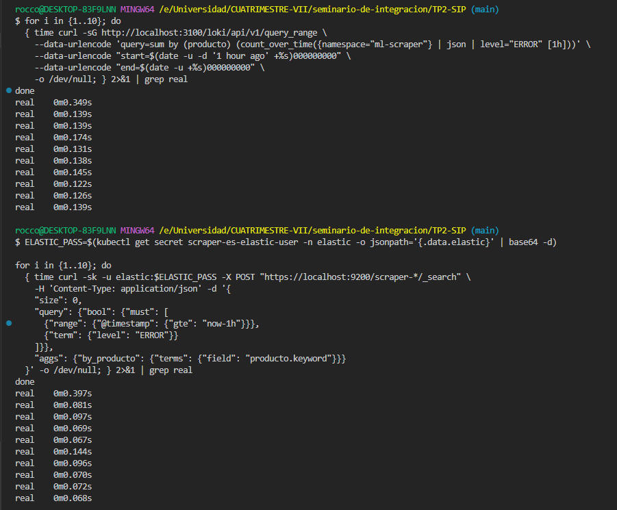

# Observability Stack — Mediciones Empíricas

Ventana de medición: **2026-05-08 — 2026-05-09** (24 hs)  
Cluster: k3d `scraper` — 1 server, 0 agents  
Workload generador de logs: `ml-scraper` (CronJob `scraper-hourly`)

---

## Tabla Resumen

| Métrica                      | Loki + Promtail + Grafana | EFK (ES + Fluent Bit + Kibana) | OTel Collector  |
| ---------------------------- | ------------------------- | ------------------------------ | --------------- |
| RAM total (MiB)              | 369 ± 22                  | 2171 ± 31                      | 90 ± 4          |
| CPU total (mCPU)             | 35 ± 10                   | 84 ± 27                        | 9 ± 2           |
| Disco PVC tras 24 h (MiB)    | 13.1                      | 8.4                            | passthrough (0) |
| Query latency p50 (ms)       | 139                       | 72                             | passthrough     |
| Query latency p95 (ms)       | 349                       | 397                            | passthrough     |
| Deploy clean → first log (s) | 238                       | 549                            | 493             |
| Tamaño imagen agente (MiB)   | 76.4                      | 39.4                           | 73.3            |

---

## Detalle por Métrica

### Métrica 1 — Footprint RAM / CPU

```bash
# Comandos utilizados
kubectl top pods -n observability --no-headers | awk '{cpu+=$2; mem+=$3} END {print "Loki stack:", cpu"m CPU,", mem"Mi RAM"}'
kubectl top pods -n elastic --no-headers | awk '{cpu+=$2; mem+=$3} END {print "EFK stack:", cpu"m CPU,", mem"Mi RAM"}'
kubectl top pods -n otel --no-headers | awk '{cpu+=$2; mem+=$3} END {print "OTel stack:", cpu"m CPU,", mem"Mi RAM"}'
```

| Muestra 1                      |                  |                 |
| ------------------------------ | ---------------- | --------------- |
| ***Stack***                    | ***CPU (mCPU)*** | ***RAM (MiB)*** |
| Loki + Promtail + Grafana      | 29               | 344             |
| EFK (ES + Fluent Bit + Kibana) | 113              | 2194            |
| OTel Collector                 | 9                | 92              |

| Muestra 2 (+1h)                |                  |                 |
| ------------------------------ | ---------------- | --------------- |
| ***Stack***                    | ***CPU (mCPU)*** | ***RAM (MiB)*** |
| Loki + Promtail + Grafana      | 30               | 385             |
| EFK (ES + Fluent Bit + Kibana) | 61               | 2182            |
| OTel Collector                 | 8                | 85              |

| Muestra 3 (+2h)                |                  |                 |
| ------------------------------ | ---------------- | --------------- |
| ***Stack***                    | ***CPU (mCPU)*** | ***RAM (MiB)*** |
| Loki + Promtail + Grafana      | 47               | 378             |
| EFK (ES + Fluent Bit + Kibana) | 78               | 2136            |
| OTel Collector                 | 11               | 93              |

---

### **Media y desviación estándar**

**Loki + Promtail + Grafana**
* CPU: muestras 29, 30, 47 → media: 35.3m | desv: 9.9m
* RAM: muestras 344, 385, 378 → media: 369 MiB | desv: 22.0 MiB

**EFK (ES + Fluent Bit + Kibana)**
* CPU: muestras 113, 61, 78 → media: 84.0m | desv: 26.6m
* RAM: muestras 2194, 2182, 2136 → media: 2170.7 MiB | desv: 30.5 MiB

**OTel Collector**
* CPU: muestras 9, 8, 11 → media: 9.3m | desv: 1.5m
* RAM: muestras 92, 85, 93 → media: 90.0 MiB | desv: 4.4 MiB

### Capturas de prueba
---



---

### Métrica 2 — Disk Usage del PVC tras 24 hs

```bash
MSYS_NO_PATHCONV=1 kubectl -n observability exec loki-0 -c loki -- du -sh /var/loki
MSYS_NO_PATHCONV=1 kubectl -n elastic exec scraper-es-default-0 -c elasticsearch -- du -sh /usr/share/elasticsearch/data
```

| Stack          | Baseline (t=0)  | Tras 24 hs      | Delta     |
| -------------- | --------------- | --------------- | --------- |
| Loki           | 1.5 MiB         | 13.1 MiB        | +11.6 MiB |
| Elasticsearch  | 7.0 MiB         | 8.4 MiB         | +1.4 MiB  |
| OTel Collector | passthrough (0) | passthrough (0) | —         |


> Verificado con `du -sh /var/lib/otelcol` dentro del pod — retorno 0 o directorio inexistente, confirma que OTel opera como pipeline sin retención local.

---

### Métrica 3 — Query Latency p50 / p95

**Pregunta canónica:** "errores del scraper en la última hora, agrupados por producto"

```bash
# Loki / LogQL — 10 corridas
for i in {1..10}; do
  { time curl -sG http://localhost:3100/loki/api/v1/query_range \
    --data-urlencode 'query=sum by (producto) (count_over_time({namespace="ml-scraper"} | json | level="ERROR" [1h]))' \
    --data-urlencode "start=$(date -u -d '1 hour ago' +%s)000000000" \
    --data-urlencode "end=$(date -u +%s)000000000" \
    -o /dev/null; } 2>&1 | grep real
done

# Elasticsearch / KQL — 10 corridas
ELASTIC_PASS=$(kubectl get secret scraper-es-elastic-user -n elastic -o jsonpath='{.data.elastic}' | base64 -d)
for i in {1..10}; do
  { time curl -sk -u elastic:$ELASTIC_PASS -X POST "https://localhost:9200/scraper-*/_search" \
    -H 'Content-Type: application/json' -d '{
    "size": 0,
    "query": {"bool": {"must": [
      {"range": {"@timestamp": {"gte": "now-1h"}}},
      {"term": {"level": "ERROR"}}
    ]}},
    "aggs": {"by_producto": {"terms": {"field": "producto.keyword"}}}
  }' -o /dev/null; } 2>&1 | grep real
done
```

**Loki — tiempos raw (ms):** 349, 139, 139, 174, 131, 138, 145, 122, 126, 139  
**Elasticsearch — tiempos raw (ms):** 397, 81, 97, 69, 67, 144, 96, 70, 72, 68

| Stack               | p50 (ms)    | p95 (ms)    |
| ------------------- | ----------- | ----------- |
| Loki (LogQL)        | 139         | 349         |
| Elasticsearch (KQL) | 72          | 397         |
| OTel → backend      | passthrough | passthrough |

> OTel no tiene query engine propio. Las queries se ejecutan contra Loki o ES según el backend destino.


> Captura real de la métrica

---

### Métrica 4 — Tiempo de Deployment desde Cero

**Metodología:** cronómetro en mano, una sola corrida por stack. Tiempo medido desde `k3d cluster create` hasta primer log del scraper visible en el visualizador (Grafana / Kibana).

```bash
# Loki
START=$(date +%s); cd observability && bash install.sh; END=$(date +%s)
echo "Loki stack deploy: $((END-START))s"

# EFK
START=$(date +%s); cd efk && bash install.sh; END=$(date +%s)
echo "EFK stack deploy: $((END-START))s"

# OTel (requiere Loki + EFK activos como backends)
START=$(date +%s); cd otel && bash install.sh; END=$(date +%s)
echo "OTel stack deploy: $((END-START))s"
```

| Stack                     | Tiempo cronómetro | Segundos |
| ------------------------- | ----------------- | -------- |
| Loki + Promtail + Grafana | 3:58,87           | 238s     |
| EFK                       | 9:09,44           | 549s     |
| OTel Collector            | 8:13,83           | 493s     |

---

### Métrica 5 — Tamaño de Imagen del Agente

```bash
docker exec k3d-scraper-server-0 crictl images | grep -E "promtail|fluent-bit|opentelemetry-collector"
```

| Agente         | Imagen                                         | Tamaño (MiB) |
| -------------- | ---------------------------------------------- | ------------ |
| Promtail       | `grafana/promtail:3.0.0`                       | 76.4         |
| Fluent Bit     | `fluent/fluent-bit:3.2.4`                      | 39.4         |
| OTel Collector | `otel/opentelemetry-collector-contrib:0.110.0` | 73.3         |

---